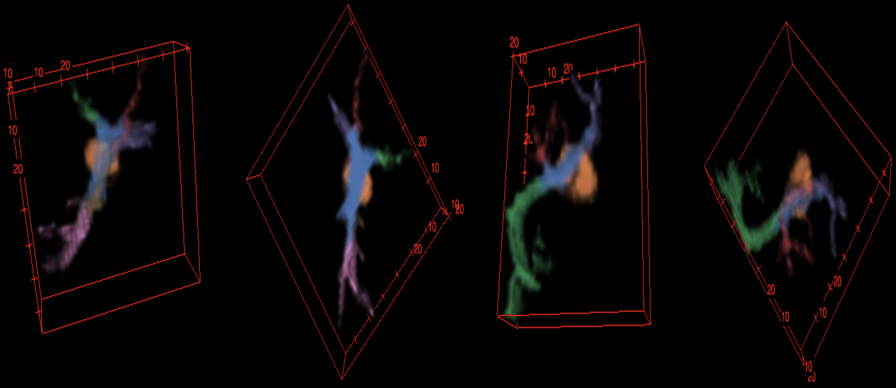

# 3D-Astrocyte-Morphology
3D-Astrocyte Image Segmentation

Must have Astrocyte segmentation weights, nuclei segmentation weights and object detection weight paths.
Read from input folder - OIB
Set params in configs/Configs.yaml
Run 'python run_model.py'

Generated output folder houses all results per slice.
Contacenate with FIJI

